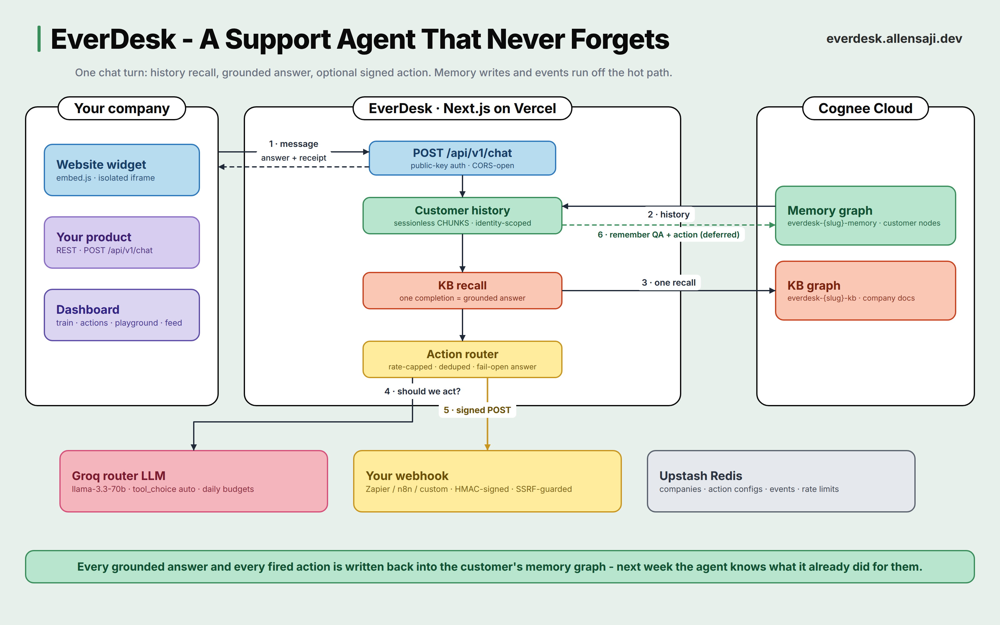

<div align="center">
  

  # EverDesk

  **A customer support agent that never forgets a customer.**

  Train it on your docs in minutes, embed it with one script tag.
  It remembers every customer, learns from every resolution, takes action
  through your webhooks, and can provably forget anyone who asks.

  [](https://everdesk.allensaji.dev)
  [](https://everdesk.allensaji.dev/docs)
  [](https://www.cognee.ai)
  [](LICENSE)

  [Live product](https://everdesk.allensaji.dev) |
  [Integration docs](https://everdesk.allensaji.dev/docs) |
  [Real deployment](https://px402.allensaji.dev) (click the chat bubble)
</div>

---

## Why

Every support bot answers questions. Almost none of them remember who they are
talking to. A customer who reported a bug last Tuesday gets treated like a
stranger on Friday, and the fix a human found for one customer helps nobody
else.

EverDesk gives every company an agent with durable, per-customer memory:

- **Returning customers are recognized.** A customer comes back days later in a
  fresh session and the agent answers with their actual history.
- **Resolutions become knowledge.** Mark a conversation resolved and the
  verified fix is written into the knowledge graph plus a skill playbook. The
  next customer with the same problem gets the answer immediately.
- **It acts, not just answers.** Configure webhook actions in plain English
  (file a refund ticket, ping the team) and the agent fires them mid
  conversation with schema-validated parameters and a signed payload.
- **It remembers what it did.** Every fired action is written back into the
  customer's memory graph. "Did my refund go through?" next week gets a real
  answer.
- **Right to be forgotten, provable.** Forgetting a customer hard-deletes their
  memory items from the graph and vector store. Their memory graph visibly
  drops to zero nodes in the dashboard.
- **You can watch it think.** A live memory feed streams every recall,
  remember, action, resolve, and forget with latencies.

## Architecture



One chat turn, end to end:

1. A customer message arrives at `POST /api/v1/chat` (public-key auth,
   CORS-open; the widget and your own backend use the same endpoint).
2. The agent pulls this customer's history from the memory graph with a cheap
   sessionless CHUNKS recall, scoped by the identity token embedded in every
   durable write.
3. One Cognee recall against the knowledge-base graph produces the grounded
   answer. One recall means one LLM completion and one session entry per turn.
   There is no separate LLM key anywhere in the answer path.
4. If the company has actions configured, a Groq-routed tool call decides
   whether exactly one action should fire. The router is rate-capped,
   budget-capped, and deduped; any failure leaves the answer untouched.
5. A firing action POSTs an HMAC-signed JSON payload to the company's webhook
   (Zapier, Make, n8n, or a custom endpoint), and the receipt is appended to
   the customer-visible answer.
6. Off the hot path, the QA turn and the fired action are written back into the
   customer's memory graph, and an ops event lands in the live dashboard feed.

### How memory is laid out

Two isolated Cognee Cloud datasets per company:

| Dataset | Contents |
|---|---|
| `everdesk-{slug}-kb` | Knowledge base: uploaded docs, pasted text, fetched URLs, learned resolutions, skill playbooks |
| `everdesk-{slug}-memory` | One shared customer-memory graph; customer identity is embedded in every durable write, so entity extraction builds a per-customer node linked to their issues, resolutions, and fired actions |

The full verified API surface, including several behaviors that differ from the
public docs, is in [docs/cognee-api-findings.md](docs/cognee-api-findings.md).

## Quickstart (use the hosted product)

1. [Onboard your company](https://everdesk.allensaji.dev/onboarding): name it,
   paste docs or URLs. Provisioning takes under two minutes.
2. Drop the widget into your site:

   ```html
   <script src="https://everdesk.allensaji.dev/embed.js"
           data-everdesk-key="pk_yourcompany_xxxxxxxx" async></script>
   ```

3. Or call the same agent from any backend:

   ```bash
   curl -X POST https://everdesk.allensaji.dev/api/v1/chat \
     -H "Content-Type: application/json" \
     -d '{
       "key": "pk_yourcompany_xxxxxxxx",
       "visitorId": "user-123",
       "email": "customer@example.com",
       "message": "How do refunds work?"
     }'
   ```

   ```json
   {
     "answer": "Refunds are processed within 7 days...",
     "grounded": true,
     "sessionId": "everdesk-acme-1a2b3c-1783150000000",
     "customerId": "cust_2b88ecea",
     "latencyMs": 7578
   }
   ```

`grounded: false` means the agent could not answer from your knowledge; a good
signal to escalate to a human, or to let an escalation action handle it.

## Actions and webhooks

Companies configure actions from the dashboard with no code:

1. Name it (`create_refund_ticket`) and describe in plain English when it
   should fire. That sentence is the prompt.
2. List the fields the agent must collect (`order_id`, text, required).
3. Point it at a webhook URL, optionally with a secret header.
4. Copy the one-time signing secret, test-fire, and enable.

Delivery guarantees:

- Payloads are signed with HMAC-SHA256 over `timestamp.body`
  (`X-Everdesk-Signature`, `X-Everdesk-Timestamp`); receivers should reject
  timestamps older than 5 minutes. Verification snippet in the
  [docs](https://everdesk.allensaji.dev/docs#actions).
- The model never chooses URLs, headers, or recipients; it only fills declared,
  server-side-validated parameters.
- URLs must be https and resolve to public addresses; DNS is re-validated at
  socket connect time, redirects are never followed, response bodies are never
  reflected.
- Rate caps: 5 fires per customer per hour, 100 per company per day, duplicate
  fires within 60 seconds are dropped.
- Every failure path fails closed for the action and open for the answer: the
  customer always gets their reply.

Slack and Discord incoming webhooks expect their own payload shape; route
those through Zapier, Make, or n8n.

## Self-hosting

Prerequisites: Node 20+, a [Cognee Cloud](https://platform.cognee.ai) tenant,
an [Upstash Redis](https://upstash.com) database, and optionally a
[Groq](https://console.groq.com) key for the actions layer.

```bash
git clone https://github.com/Allen-Saji/everdesk
cd everdesk
npm install
cp .env.local.example .env.local   # fill in credentials
npm run dev
```

| Variable | Required | Purpose |
|---|---|---|
| `COGNEE_BASE_URL` | yes | Cognee Cloud tenant URL |
| `COGNEE_API_KEY` | yes | Cognee Cloud API key |
| `COGNEE_TENANT_ID` | no | Multi-tenant header, if your tenant needs it |
| `KV_REST_API_URL` | yes | Upstash Redis REST URL |
| `KV_REST_API_TOKEN` | yes | Upstash Redis REST token |
| `GROQ_API_KEY` | no | Actions router; absent = actions layer silently off |

`scripts/spike.mjs`, `spike2.mjs`, and `spike3.mjs` verify Cognee endpoint
behavior against a real tenant. `scripts/test-beats.sh` runs the memory beat
suite against a local server.

## Project layout

```
src/
  app/
    api/v1/chat/          public chat endpoint (widget + REST consumers)
    api/companies/        provisioning, training, actions CRUD, forget, resolve
    dashboard/[slug]/     overview, training, playground, actions, customers,
                          conversations, memory feed, settings
    widget/               iframe chat surface served to embed.js
  lib/
    agent.ts              the chat turn: recall, answer, action, remember
    cognee.ts             typed Cognee Cloud REST client
    actions.ts            action configs, rate limits, dedupe, redaction
    action-router.ts      Groq tool-call routing with strict arg validation
    webhook.ts            SSRF-guarded, HMAC-signed webhook delivery
    companies.ts          company + visitor records (Upstash)
    events.ts             ops-event feed backing the live dashboard
public/embed.js           the one-tag widget loader
docs/                     architecture diagram + verified Cognee API findings
```

## Security notes

- Secrets (webhook header values, signing secrets) are write-only: no GET
  endpoint ever returns them, and the signing secret is shown exactly once at
  creation.
- The public chat endpoint treats all customer and retrieved content as data,
  never instructions; action arguments are re-validated server-side against
  the declared schema.
- Known limitation: the dashboard is unauthenticated (hackathon build). Anyone
  who knows a company slug can view its dashboard and edit its action configs.
  Action endpoints are rate limited per slug and per IP as partial mitigation,
  but config integrity ultimately needs dashboard auth.

## Stack

Next.js (App Router, TypeScript, Tailwind v4) on Vercel. Upstash Redis for
company records, action configs, and the ops-event feed. Cognee Cloud over
plain REST for all memory, retrieval, sessions, skills, and graph data. Groq
for action routing. Cytoscape for the customer memory graph.

Built for the Cognee hackathon (Best Use of Cognee Cloud track). Every byte of
agent memory lives in Cognee Cloud knowledge graphs.

## License

[MIT](LICENSE)
